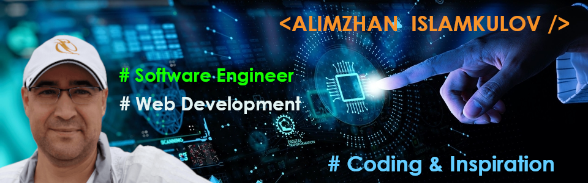

# Alimzhan Islamkulov
## I am Software Web Developer

  Experienced Software Engineer with a demonstrated history of working in the computer software industry. Skilled in JavaScript, React js, Redux, Node.js, Software Development - Web Development. Strong engineering with a Master's degree in Computer and Medical Science. I’m constantly searching for new technologies to test and learn by doing, and following different guides I found around the web. I also really like dogs, traveling and camping. These things inspire me a lot. End of course special thanks and gratitude to my teacher Alla from canshecode.

## My Stack of Technologies:
* ⚛ React
* ⚛ Redux
* ⚛ Node.js
* 💻 GSAP
* 💻 Figma
* 🖥️ Bootstrap
* 🖥️ Javascript, HTML, CSS
	
        

