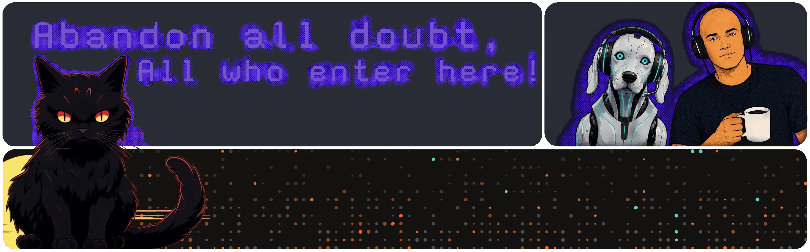

## Websites/Content/Services/Apps Creator 

[](https://git.io/typing-svg)


```code
Full-stack developer working across React, TypeScript, Node.js, and Python.
Builds static sites with Astro and Eleventy, and dynamic apps with Express, MongoDB, and MySQL.
Styles everything with Sass, Tailwind, and Bootstrap, then ships to Netlify, Render, or GitHub Pages.
Uses LLM looping and context engineering to speed up development, and works out of LASTH / AL Tech Labs.
```


### Languages and Tools:


---

### Streak stats:

[](https://git.io/streak-stats)

---

### Find me in this place:
[](https://www.linkedin.com/in/alimzhan-islamkulov-109b8b257/)


